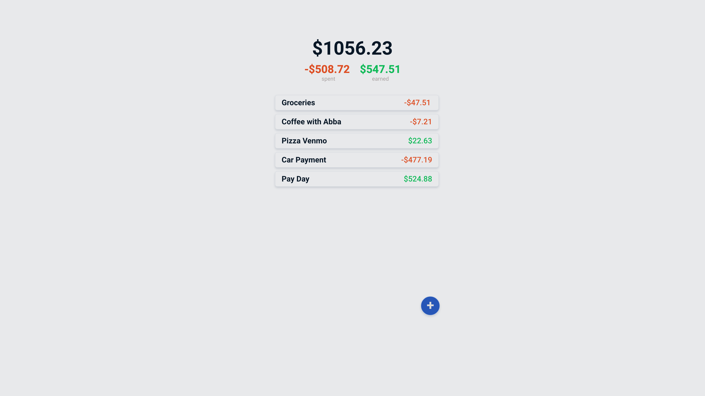

# RL Frontend Developer Interview Project
This repository is serves as boilerplate for the RL Frontend Developer Interview

# Project Scope
Your mission, should you choose to except it, is to build a react-ts based expense tracker. The base of the app has been provide to you. to begin  run `npm run dev`.

## Client
The client is to be built with React JS [Functional Components](https://reactjs.org/docs/components-and-props.html). Any CSS framework is acceptable. I personally have been enjoying [Daisy UI](https://daisyui.com/), which is built on [Tailwind CSS](https://tailwindcss.com/).  However you are not use a UI Component library (i.e. no react-bootstrap, material-ui, semantic-ui, etc).

The application should like something like this. *Please note that this not a final design is not required to be identical.*

You will need to figure out how to make a POST request from the app. The are several ways to approach this including built in functions, or third party libraries. 
## API
The project is backed by [JSON Server](https://github.com/typicode/json-server#table-of-contents), a ready made ease to use RESTful API. The API can be accessed at [http://localhost:3001](http://localhost:3001). The endpoint you will be utilizing is located at [http://localhost:3001/transactions](http://localhost:3001/transactions). The API is self documenting. Documentation can be found at [http://localhost:3001/](http://localhost:3001/), and the full set of data can be retreived from [http://localhost:3001/db](http://localhost:3001/db).

The API comes pre-populated with random fake data that is generated anew with each restart. You can change the structure of the database but editing the `db-generator.js`. For a list of generatable data, please consult the [faker.js](http://marak.github.io/faker.js/) documentation. Further reading is available [here](https://github.com/typicode/json-server#table-of-contents).

## Acceptance Criteria
1. Show a total for the money in/out
2. Users can add a new transaction (POST request), but transactions cannot be deleted or modified. This means adjustments should be made by creating a new entry.
3. Build as many components as you feel necessary to complete the task, but a minimum of one is required

---

THIS MESSAGE WILL EXPLODE IN 

